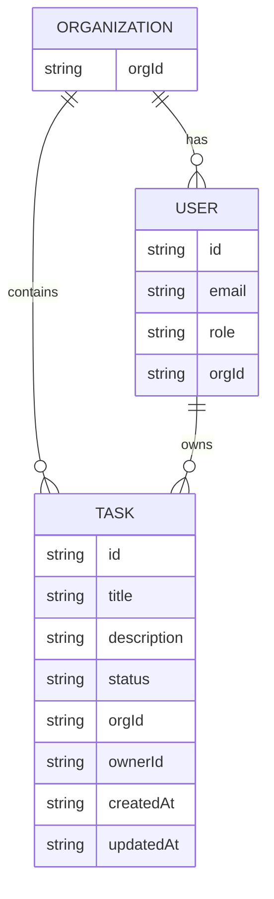

# 📌 Secure Task Management System (Nx Monorepo)

A small Nx monorepo implementing a task management system with:

* NestJS API (JWT Auth, RBAC, org scoping, CRUD tasks)

* Angular dashboard (login, health check, tasks UI)

* Shared TypeScript libraries (DTOs, role helpers)

* Fully working local setup + tests

This project was built to demonstrate practical full-stack engineering with clean architecture, modular design, and secure authorization.

---

### ▶️ Project Setup

#### Install dependencies
```bash
npm install --legacy-peer-deps
```

#### ️Run the API
```bash
nx serve api
```

Runs on: http://localhost:3000

#### Run the Angular dashboard
```bash
nx serve dashboard
```

Runs on: http://localhost:4200

#### Run tests
```bash
nx test api
nx test dashboard
```

---
### 🧪 Testing

#### Backend (NestJS + Jest)

Located: `apps/api/src/app/tasks/tasks.service.spec.ts`

Covers:

* Role permissions (viewer/admin/owner)

* Org scoping

* Forbidden actions

* Missing resource errors

#### Frontend (Angular + Jest)

Located: `apps/dashboard/src/app/dashboard/dashboard.component.spec.ts`

Covers:

* Component creation

* Mocked service interactions

* Dashboard initialization behavior

---
### 🏗 Architecture Overview
#### Monorepo Structure

```bash
apps/
  api/           # NestJS backend
    src/app/
      auth/      # JWT auth, controllers, strategies
      tasks/     # Task CRUD with RBAC + org scoping
      app.*      # root app module, controller, service
  dashboard/     # Angular frontend (standalone components)
    src/app/
      dashboard/ # Main dashboard UI
      login/     # Login page
libs/
  data/          # Shared DTOs + interfaces
  auth/          # Shared RBAC utilities (Roles, RolesGuard, org helpers)
```
--- 
#### Authentication

* JWT-based (`Bearer <token>`)

* `AuthController` exposes:

  * `POST /auth/login`

  * `GET /auth/me`

* Tokens encode:

  * `sub` (user ID)

  * `email`

  * `role` (owner/admin/viewer)

  * `orgId`

Users are seeded for demo (owner, admin, viewer)

---

### 🔒 Access Control Implementation (RBAC)

RBAC implemented through:

* @Roles() decorator

* RolesGuard

* simple role hierarchy:

```pgsql
viewer  -> read-only
admin   -> create/update/delete within org
owner   -> full access to org resources
```

Org scoping guarantees a user can only access entities belonging to their own orgId.

Located in:
`libs/auth/`

---
### Tasks Module

Features:

* List tasks (`GET /tasks`)

* Create task (`POST /tasks`)

* Update task (`PUT /tasks/:id`)

* Delete task (`DELETE /tasks/:id`)

* All operations scoped to user’s org

* Backend stores tasks in-memory (simple for demo)

* Each task includes:

  * title, description, status

  * orgId, ownerId

  * createdAt, updatedAt

Located in:
`apps/api/src/app/tasks/`

---

### Angular Dashboard

The dashboard includes:

#### 🔐 Login page

* Calls `/auth/login`

* Stores token in localStorage

* Adds JWT via interceptor for API calls

#### 📊 Dashboard

* Displays API health via `/health`

* Fetches tasks via `/tasks`

* Create / delete tasks for authorized users

* Viewer role → read-only view

The UI uses standalone components for simplicity and structure.

---
### 📁 Data Model Explanation

This project uses a simple logical data model centered around three core concepts:

* Organization – a tenant boundary for users and tasks

* User – an authenticated actor with a role within an organization

* Task – a unit of work scoped to an organization and owned by a user

In this implementation, data is stored in memory for simplicity, but the shapes are designed to map directly to a relational schema (e.g. Postgres) later.

#### Entities and Fields
**Organization**

Represents a logical tenant or customer.

| Field | Type   | Description                                                    |
| ----- | ------ | -------------------------------------------------------------- |
| orgId | string | Unique identifier for the org                                  |
| name  | string | Display name |

**User**

Represents an authenticated user who belongs to exactly one organization and has a role.

| Field | Type   | Description                                     |
| ----- | ------ | ----------------------------------------------- |
| id    | string | Unique user identifier                          |
| email | string | Login/email address                             |
| role  | string | `owner`, `admin`, or `viewer`                   |
| orgId | string | Foreign key referencing the user’s organization |

In the JWT payload, these appear as:

* `sub` (user id)

* `email`

* `role`

* `orgId`

**Task**

Represents a single task within an organization, created and owned by a user.

| Field       | Type   | Description                                   |
| ----------- | ------ | --------------------------------------------- |
| id          | string | Unique task identifier                        |
| title       | string | Short title                                   |
| description | string | Optional longer description                   |
| status      | string | `todo`, `in_progress`, or `done`              |
| orgId       | string | Foreign key referencing the owning org        |
| ownerId     | string | Foreign key referencing the owning user       |
| createdAt   | string | ISO timestamp when the task was created       |
| updatedAt   | string | ISO timestamp when the task was last modified |

All task operations are scoped by `orgId`, and write operations (create, update, delete) are additionally restricted by the user’s `role`.

---

**Logical ERD / Relationships**

At a high level, the relationships are:

* One `Organization` has many `Users`

* One `Organization` has many `Tasks`

* One `User` can own many `Tasks`




---

### 🔌 API Endpoints

#### Auth
| Method | Path        | Description                  |
| ------ | ----------- | ---------------------------- |
| POST   | /auth/login | Authenticate and receive JWT |
| GET    | /auth/me    | Get user info from token     |

#### Tasks
| Method | Path       | Permissions | Description              |
| ------ | ---------- | ----------- | ------------------------ |
| GET    | /tasks     | viewer+     | List tasks in user’s org |
| POST   | /tasks     | admin+      | Create task              |
| PUT    | /tasks/:id | admin+      | Update task              |
| DELETE | /tasks/:id | admin+      | Delete task              |

---

### 🚀 Opportunities for Future Improvements

If this were a production system, next steps would include:

* Postgres / Prisma instead of in-memory storage

* Refresh tokens / rotation strategy

* UI enhancements (status editing, better styling)

* Angular route guards + feature modules

* Audit log persistence

* E2E tests via Nx + Cypress or Playwright